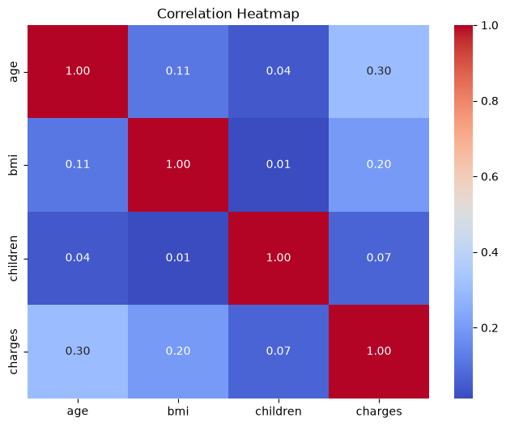
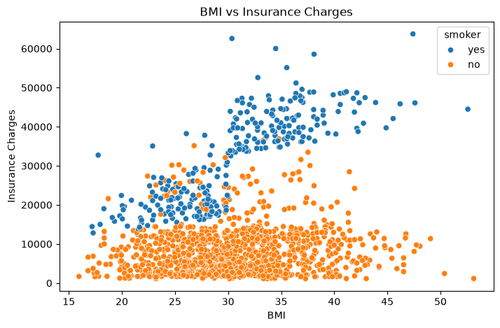
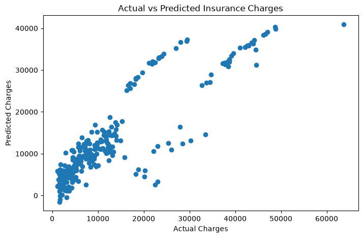
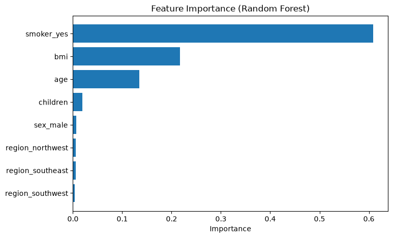

# Health Insurance Premium Prediction

This project predicts individual health insurance charges using machine learning regression models. It covers the complete data science workflow, including data exploration, visualization, preprocessing, model building, evaluation, and interpretation.

---

## Project Overview

Health insurance premiums are influenced by factors such as age, BMI, smoking status, and family size. The objective of this project was to analyze these factors and develop machine learning models capable of accurately predicting insurance charges.

The project compares multiple regression algorithms and evaluates their performance using standard regression metrics.

---

## Dataset

The project uses the **Medical Cost Personal Dataset**, containing **1,338 records** with the following features.

**Source:** https://www.kaggle.com/datasets/mirichoi0218/insurance

The dataset includes the following features:

| Feature | Description |
|---------|-------------|
| Age | Age of the insured individual |
| Sex | Gender |
| BMI | Body Mass Index |
| Children | Number of dependents |
| Smoker | Smoking status |
| Region | Residential region |
| Charges | Medical insurance charges (Target Variable) |

---

## Exploratory Data Analysis

The dataset was explored to understand the distribution of variables, relationships between features, and factors affecting insurance charges.

### Correlation Heatmap



**Observation**

- Smoking status has the strongest correlation with insurance charges.
- Age and BMI also show a positive relationship with medical costs.

---

### BMI Distribution



**Observation**

- BMI follows an approximately normal distribution.
- Most observations lie between 25 and 35, with relatively few extreme values.

---

## Data Preprocessing

The following preprocessing steps were performed:

- Checked data types
- Verified missing values and duplicates
- Encoded categorical variables
- Split the dataset into training and testing sets

---

## Models Implemented

The following regression models were trained and evaluated:

- Linear Regression
- Decision Tree Regressor
- Random Forest Regressor

---

## Model Performance

| Model | MAE | RMSE | R² Score |
|------|------:|------:|------:|
| Linear Regression | 4181.19 | 5796.28 | 0.7836 |
| Decision Tree Regressor | 3384.47 | 6861.24 | 0.6968 |
| Random Forest Regressor | **2544.64** | **4573.55** | **0.8653** |

The Random Forest model achieved the best overall performance, producing the lowest prediction error and the highest R² score.

---

## Actual vs Predicted Values



**Observation**

The predicted values closely follow the actual insurance charges, indicating that the Random Forest model captures the relationship between the input features and insurance costs effectively.

---

## Feature Importance



**Observation**

Smoking status is the most influential feature, followed by age and BMI. These variables contribute the most to predicting insurance charges.

---

## Technologies Used

- Python
- Pandas
- NumPy
- Matplotlib
- Seaborn
- Scikit-learn
- Joblib
- Jupyter Notebook

---

## Project Structure

```
health_insurance_premium_prediction/
│
├── data/
│   └── insurance.csv
│
├── images/
│   ├── actual_vs_predicted.png
│   ├── bmi_distribution.png
│   ├── correlation_heatmap.png
│   └── feature_importance.png
│
├── models/
│   └── random_forest_model.pkl
│
├── notebooks/
│   └── insurance_analysis.ipynb
│
├── README.md
├── requirements.txt
└── .gitignore
```

---

## Getting Started

Clone the repository:

```bash
git clone https://github.com/varnikaattri4/health_insurance_premium_prediction.git
```

Install the required packages:

```bash
pip install -r requirements.txt
```

Open the notebook inside the `notebooks` folder and run all cells.

---

## Future Improvements

- Perform hyperparameter tuning
- Apply cross-validation
- Compare additional ensemble models such as XGBoost and LightGBM
- Deploy the model using Streamlit

---

## Author

**Varnika Attri**
